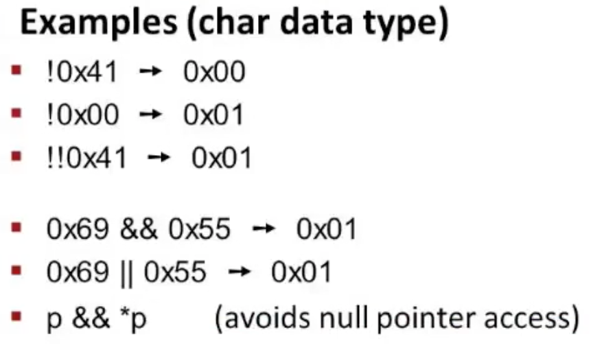
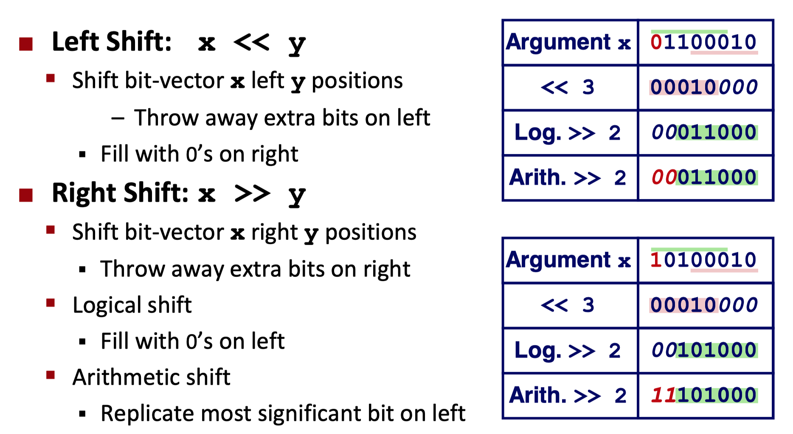
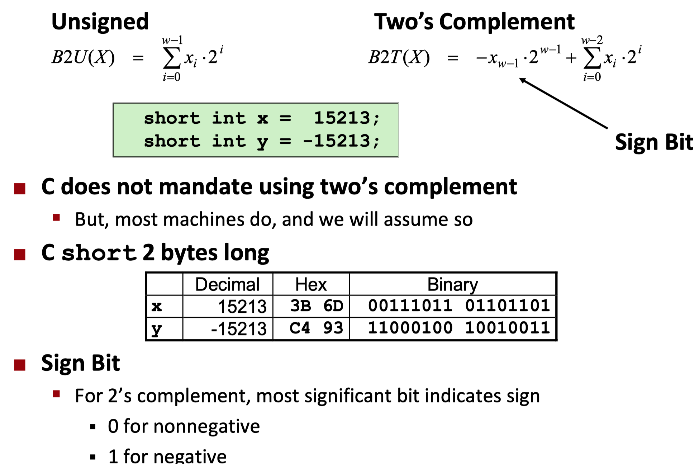
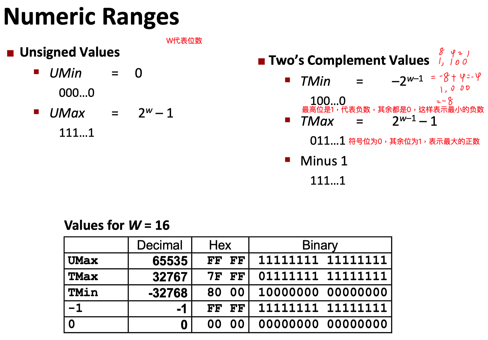

## 位操作
* &
* |
* ^异或，0^1=1,不同为1，相同为0
* ~非

## 逻辑操作，区别于位操作
* &&
* ||
* !
* 0被视作false，非0被视为true
* 举例，返回值就是代表true或false，p&&*p的作用是先判断指针p是否位空指针，如果是空，则就能避免对空指针的使用
  
## 位移
* 左移
* 右移
  * 逻辑右移：用0填充
  * 算术右移：用符号位的数填充
* 
  
举例

## 整数编码

*signbit表示符号位，我们默认数字在机器中以补码形式存在* 
     

*数字范围*

